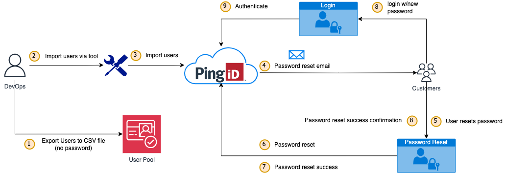

## User Migration from AWS Cognito to PingID
### Problem Statement
AWS Cognito does not provide native disaster recovery support, making it challenging for organizations to ensure business continuity in the event of service disruptions or data loss. Implementing a custom disaster recovery solution within AWS Cognito can be tedious and resource-intensive, leading to potential risks and inefficiencies in managing user authentication and identity management. To address these limitations and enhance security, scalability, and disaster recovery capabilities, PingID has been chosen as a replacement for AWS Cognito.

### Migration Approaches

#### A. On-Demand User Migration 🔄

- **Overview**: Users are migrated to PingID as they log in or access services.
- **Process**:
  1. Users log in through AWS Cognito 🔑.
  2. Check if the user is already in PingID.
  3. If not migrated:
     - Extract user data 📥.
     - Transform and create user account in PingID 🔒.
     - Notify users of migration 📧.
  4. Send verification email ✅.
  
- **Advantages**:
  - Minimal disruption for users 🔄.
  - Reduced initial workload for IT teams 💼.

- **Challenges**:
  - Potential delays during first login ⏳.
  - Need for robust error handling ⚠️.

---

##### B. Bulk User Migration 📊

- **Overview**: All user accounts are migrated to PingID in a single operation.
- **Process**:
  1. Extract all user data from AWS Cognito 📥.
  2. Transform data to fit PingID's requirements 🔄.
  3. Create user accounts in PingID using API or bulk import 🛠️.
  4. Migrate passwords (or prompt for reset if necessary) 🔑.
  5. Notify users of migration 📧.
  6. Verify and test post-migration access ✅.
  
- **Advantages**:
  - Seamless user experience 🚀.
  - Comprehensive migration reduces repeated processes 📊.

- **Challenges**:
  - High initial workload for IT teams ⚙️.
  - Potential downtime during migration ⏳.

