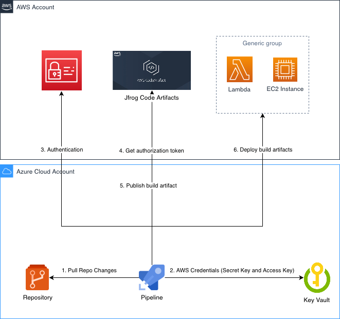

### 🔧 Built DevOps Pipeline using Azure DevOps and Code Repository to Deploy Resources in AWS Environment

**Problem Statement:**  
The team uses Azure services for code repository and CI/CD pipeline to build artifacts and deploy resources both in Azure and AWS.

**Proposed Solution:**  
Designed and implemented a robust DevOps pipeline leveraging **Azure DevOps** on the Azure platform for continuous integration and continuous delivery (CI/CD). The solution utilized **Azure Repos** for source code management and **Azure Pipelines** to automate build, test, and deployment processes. The entire DevOps pipeline was automated using **Terraform Infrastructure as Code (IaC)**, allowing for consistent and repeatable deployments of infrastructure and applications in a secure **AWS** environment. By fully utilizing Terraform, the pipeline ensured scalable, reliable, and efficient deployments, minimizing manual intervention and reducing deployment time while maintaining security best practices throughout the deployment process.

